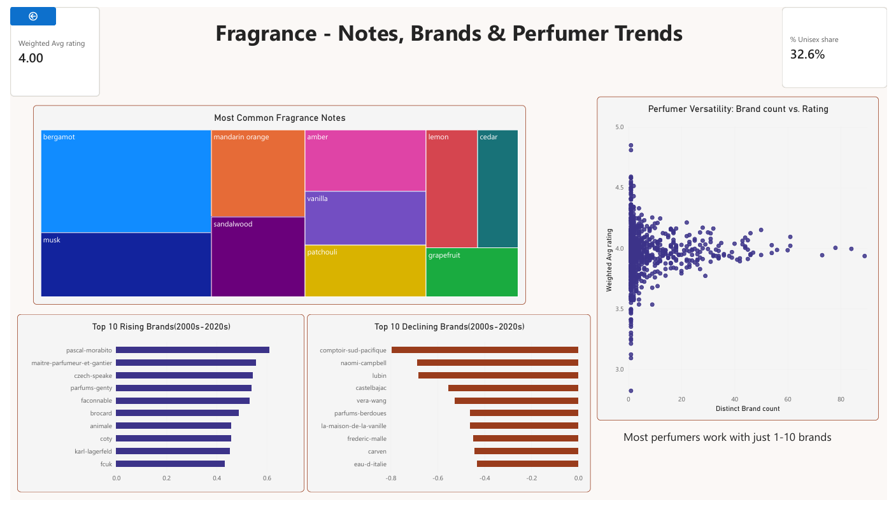
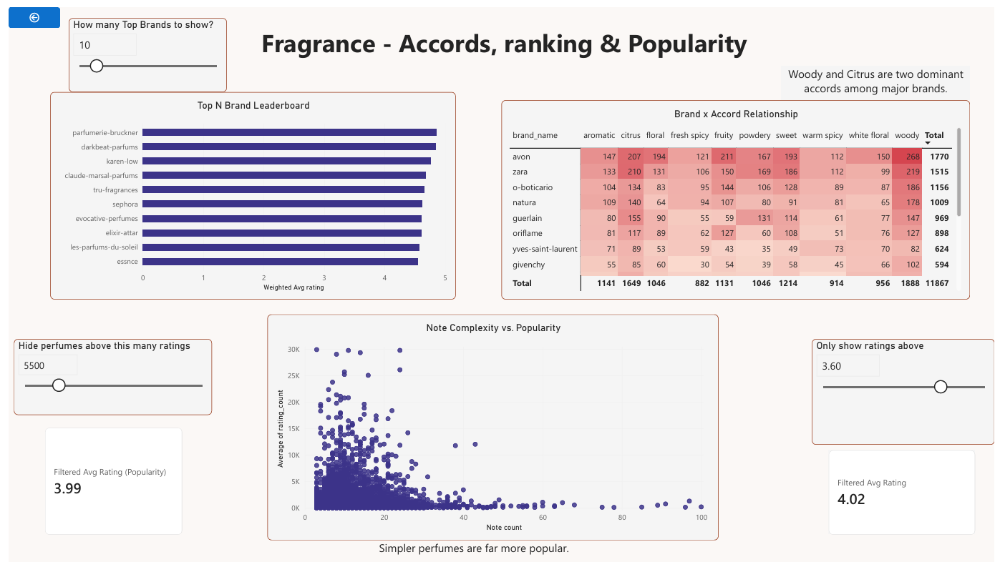

# luxury-fragrance-powerbi-dashboard

An interactive Power BI dashboard analyzing fragrance brands, notes, accords, perfumers. It is built on a MySQL database that I designed, cleaned and normalized in my SQL project.

SQL project : https://github.com/Ayushi58/luxury-fragrance-sql-portfolio

## Dashboard Preview

## What the Dashboard covers

- Page 1: Notes, brands and perfumer trends
- Page 2: Accords, brand ranking and popularity
- Interactive sliders that let you filter by rating and popularity

## Key Findings

- Bergamot and musk are by far the most common fragrance notes.
- Perfumers who work with many brands are rated about the same as those who work with few.
- Woody and citrus are the most common accords among major brands.
- Simpler perfumes with fewer notes are far more popular.
- Some individual brands changed by up to 0.8 rating points between 2000s and 2020s.

## Tools

Power BI, MySQL, DAX

## Files in this repo

The full dashboard PDF and the Power BI file are included in this repo.
